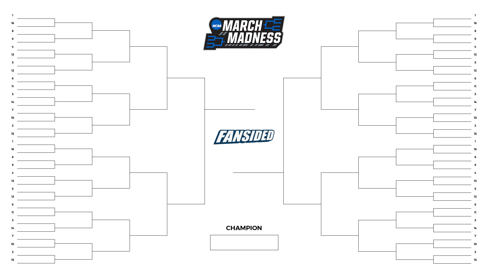
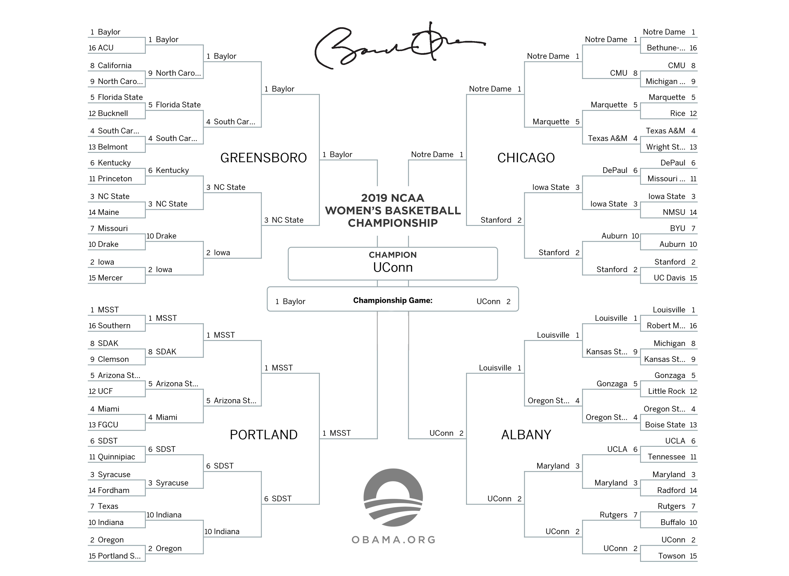

```{r, message = FALSE}
#loading packages
library(knitr)
library(ggplot2)
library(dplyr)
library(gridExtra)
library(plotly)
library(ggiraph)

#loading data
tourney_data <- readr::read_csv("https://raw.githubusercontent.com/fivethirtyeight/data/master/ncaa-womens-basketball-tournament/ncaa-womens-basketball-tournament-history.csv")

#filtering out 8 teams that would be too difficult to work with (no seed and very little information variables for those observations)
tourney_data <- tourney_data%>%
  filter(Seed != "(OR)")

```

---

## Introduction
### Introduction to the goal of the Project

If you were to just fill out this bracket randomly, you would have a roughly **1 in 9.2 quintilion** chance of guessing the right bracket. Well, luckily for you, this is your shining moment (*haha, get it?*). This probably (most definitely) will not help you get a perfect bracket, but it could help you win points in betting pools with your friends. In this project, we will analyze the most determinant factors for each game of the first game of the Women's NCAA Tournament.




### About the Dataset

The data set, from FiveThirtyEight, can be found [here](https://github.com/rfordatascience/tidytuesday/blob/master/data/2020/2020-10-06/readme.md). The data set contains 2092 observations (teams) and 19 variables, which are:

```{r, echo = FALSE}
kable(variable.names(tourney_data), col.names = "Variables")
```

In these variables, for clarification:

- "W" stands for win.
- "L" stands for loss.
- "%" stands for win percentage.

We will mainly looking at Tourney W to determine the winners and losers in the first weekend of the NCAA tournament, and then look at a variety of measurements to help predict who should be the winners and losers, such as:

- Seed
- Conference
- Regular Season Winning Percentage

### Explaining the Tournament

The Woman's NCAA tournament today contains 64 teams, and it has been this way since 1995. Each team is seeded 1 through 16, and there are 4 different regions (see empty bracket above if confused). To start the tournament, the 1 seed plays the 16 seed, the 2 seed plays the 15 seed, the three seed plays the 14 seed, and so on.The winner moves on to the next round, and if they keep winning, they keep advancing into the tournament. If you lose, your season is over, it is a single elimination tournament.

To qualify for the tournament, 32 (really 31, the Ivy League chooses the best Conference Regular Season team, they have no tournament) teams auto-qualify by winning their conference tournament. The remaining 32 teams are selected by a committee to be seeded based on their regular season standings and results. 

The top 16 seeds (1-4 seed for each region) for the first 2 games (the first weekend) have home court advantage. The next weekend, usually a non-home court venue is chosen ahead of time to be played at. You call these games "The Sweet Sixteen" and "The Elite Eight" (since there are only 16 and 8 teams left). Then, the regional champions meet up at what is called the "Final Four" to play what is the remaining 2 rounds, including the championship game.

In the end, it should look something like this:




### The First Game

The first game is **by far** the **hardest to predict**. This is due to the sheer amount of teams playing in the first games (64) and the amount of games being played (32). It is also the most damaging to your bracket, if you have a team going to the Elite Eight and they lose in the first round, your bracket is **busted!**

---

## The First Factor

We will first want to divide the winners of the first games and the losers of the first game by filtering our data set. This will allow us to divide the groups and find what qualities of a team can lead to a win, or lead to a loss. We do this by:

```{r}
first_game_winners <- tourney_data %>%
  filter(`Tourney W`  > 0)

first_game_losers <- tourney_data %>%
  filter(`Tourney W` == 0)
```

### Graphically Summarizing the First Factor
And we then can use these newly filtered datasets to create a graph showing who loses and wins by seed:

```{r, echo = FALSE}
graph_1 <- ggplot(first_game_losers)+
  geom_bar(aes(x = as.integer(Seed)),
           fill = "red",
           color = "black")+
  labs(title = "Number of Losers by Seed in First Round",
       x = "Seed",
       y = "Number of Teams",
       caption = "From the Losers of a Women's NCAA Tournament Dataset")+
  theme_minimal()
```


```{r, out.width = c('90%', '90%'), fig.show='hold', fig.width = 10}

graph_2 <- ggplot(first_game_winners)+
  geom_bar(aes(x = as.integer(Seed)),
           fill = "forestgreen",
           color = "black")+
  labs(title = "Number of Winners by Seed in First Round",
       x = "Seed",
       y = "Number of Teams",
       caption = "From the Winners of a Women's NCAA Tournament Dataset")+
  theme_minimal()

grid.arrange(graph_2, graph_1, nrow =1)
```

*Note: These two graphs were made using the Grid Arrange Feature of the GridExtra package, where we are able to compare the number of wins and losses per seed in a women's NCAA tournament. *

#### How this Graph was made in R

Both of these graphs were first written as usual code using the ggplot2 package. The geometric object we used was "geom_bar". We did run to an issue with this geometric object, where it would not treat the seeds as categorical, which we wanted to use. This would make the data look very scrambleb and hard to read, and we fixed that by using "as.integer()". They were then stored as objects, which allowed us to implement them into the "grid.arrange()" function as one row, by using the argument "nrow  = 1". The last thing we had to fix was the overlap the graphs appeared to have. We fixed this by using arguments in the brackets at the top of the code chunk and editing the width of the objects output.

#### What does this Graph tell us?

When examining these graphs, one can see there is a positive correlation between being a higher seed (seed closer to 1) and wins in the first round, and a negative correlation on being a higher seed and losses in the first round. We also can see that, especially when looking at the graph displaying the losses per seed, there is a large gap between the 4th and 5th seed in terms of winning and losing. If we want to examine this more in depth, we can analyze this numerically.


### Numerically Summarizing the First Factor

```{r}
conf_seed_win_perc <- tourney_data %>%
  mutate(DidAdv = ifelse(`Tourney W` > 0, TRUE, 
                               FALSE))%>%
  group_by(as.integer(Seed))%>%
  summarise(SeedWinPerc = mean(`DidAdv`), MeanWins = mean(`Tourney W`), SDofWins = sd(`Tourney W`))
kable(conf_seed_win_perc, col.names = c("Seed", "Proportion Advancing", "Mean Wins", "SD of Wins"))
```

*Note: This numerical summary displays the proportion of teams advancing past the first round, mean number of wins in the tournament, and the standard deviation of wins by seed in the Women's NCAA tournament.*

#### How this Numerical Summary was made in R

To obtain this numerical summary, we first piped the tournament data into the mutate function to create a new variable. We mutated a Boolean variable to determine if a team advanced or not (True or False). We then piped this data into the "group_by()" function and grouped by seed, as that is what we are investigating as a factor. We then piped this into the "summarise()" function, where we calculated the proportion of teams advancing past the first round, the mean number of wins, and the standard deviation of wins. (What is indicated by the mean number of wins and standard deviation will be included later.) We then stored all of this into an object so that we could us the "kable()" function from the knitr package. In this function, we were able to give our columns more proper names by using the "c()" function.


#### What this Numerical Summary tells us

We can clearly see that Seeds One through Four dominate the first round of the NCAA tournament, and there is a gap of the winning percentage of teams seeded at 4 and teams seeded at 5, as there is one between teams seeded at 13 and teams seeded at 12. Teams seeded 5 also appear to tend to lose at least one game in a tournament, as there are 4 games played at a certain seed, and they are just below .75, telling us that it is probable that at least one of the four 5 seeded teams will lose to a 12 seed, and this occurs for the rest of, from this point on, what we will call "middle seeded teams," or teams seeded 5 through 12. 

We also in this numerical summary included the mean number of wins per seed in the NCAA tournament, and the SD of the wins per seed in an NCAA tournament. What these two columns tell us is that higher seeded teams, teams that tend to win the first round game as explained in the previous paragraph, tend to go much farther in the NCAA tournament. We can also see that, especially in seeds 1 through 4, that the probability of these teams not advancing past the first round using the mean and standard deviation is low. 0 wins for these teams is often 2 standard deviations away from the mean wins in the tournament, and to get an occurrence 2 standard deviations away from the mean would be very rare and unpredictable. We can also see that the standard deviation of teams that win few games in the NCAA tournament and very rarely make it past the first round, very rarely go on to win more games past the first round, there variability is very low. If you bet against these teams that tend to go farther (seen by the mean wins), your bracket will likely be completely **busted**, as they tend to go farther and gain more points, while the teams you bet on to beat them (first of all will not likely win), will almost surely not go further. 

For example, if you have the 16th seed winning (which you shouldn't) 2 games, this is almost 6 to 7 standard deviations away from the mean. This has almost no chance of happening. Compare this to the 1st seed winning 2 games, this is within one standard deviation of the mean and likely to happen. 

For these reasons, teams seeded higher tend to go farther and win more in the first round, and teams seeded lower tend to very rarely get past the first round, and almost never get their **shining moment**.

### Conclusion Of The First Factor

As seen above, the most determinant factor for predicting a first round win is seed. The Lower (higher in number) seeds, mainly 13 - 16, predominantly and historically lose in the first round. Therefore, the higher seeds (lower in number), 1 - 4, almost always win in the first round. You should predict seeds 1 - 4 to go to the next round, although an upset has a good chance of happening. (you will also see later that the major upsets that do happen, rarely go on to the later rounds and completely bust your bracket, so, to be safe, do this)

While this makes it easier to predict half of the first round games, it is significantly harder to predict (as seen in the major jump between losers at the 4 seed and 5 seed) the next 16 games between seeds 5 - 12. So, we will need to filter these teams out to find the differing qualities:
```{r}
first_game_losers_mid <- first_game_losers %>%
  filter(between(`Seed`, 5, 12))

first_game_winners_mid <- first_game_winners %>%
  filter(between(`Seed`, 5, 12)) 
```
*Note: This filters the data set into the next section of data we will analyze: the middle seeded teams. This is done by piping the first game losers and winners data sets into the "filter()" function, where we filter for all the seeds between 5 and 12, using the "between()" function.*

---

## The Second Factor
One of the major determining factors in these mid-seeded match ups is the type of conference that the school comes from. We will see a graph displaying the number of teams that won and advance by conference and the number of teams that lost in the first round of the tournament.
```{r}
count_fgwm <- first_game_winners_mid %>%
  group_by(Conference)%>%
  summarise(Count = n())
count_fglm <- first_game_losers_mid %>%
  group_by(Conference)%>%
  summarise(Count = n())

```

*Note: This chunk of code crates two new objects by taking the middle seeded data sets (the winners and losers) and pipes it into a "group_by()" function, where the data was grouped by conference. Then we used the "summarise()" function to allow us to cretae a count of each number of winners and losers from each conference.*

### Graphically Summarizing the Second Factor Pt. 1
```{r}

fgwm_tooltip <- c(paste0("Conference: ", count_fgwm$Conference, "\n Wins: ", count_fgwm$Count))

gg_3 <- ggplot(count_fgwm, aes(reorder(Conference, Count), x = Count)) +
  geom_col_interactive(aes(tooltip = fgwm_tooltip, data_id = Conference),
                       fill = "green",
                       color = "black")+
  theme_minimal()+
  labs(title = "Number of Wins per Conference",
       x = "Number of Wins",
       y = "Conference",
       caption = "From a filtered women's NCAA tournament dataset, showing only the mid-seeded teams and the first round.")
ggiraph(code = print(gg_3), hover_css = "fill-opacity:1;cursor:pointer;fill:blue", zoom_max = 5)  

```

```{r, echo = FALSE}
fglm_tooltip <- c(paste0("Conference: ", count_fglm$Conference, "\n Losses: ", count_fglm$Count))

gg_4 <- ggplot(count_fglm, aes(reorder(Conference, Count), x = Count)) +
  geom_col_interactive(aes(tooltip = fglm_tooltip, data_id = Conference),
                       fill = "red",
                       color = "black")+
  theme_minimal()+
  labs(title = "Number of Losses per Conference",
       x = "Number of Losses",
       y = "Conference",
       caption = "From a filtered women's NCAA tournament dataset, showing only the mid-seeded teams and the first round.")
ggiraph(code = print(gg_4), hover_css = "fill-opacity:1;cursor:pointer;fill:yellow", zoom_max = 5)  

```

*Note: These graphs were created using the Ggiraph package, a package that allows you to make interactive graphs. They display the number of mid-seeded teams winning and losing in the first round of the NCAA tournament.*

#### How these graphs were made in R

As said before, these graphs were made using ggiraph, a package that I find really similar in code to ggplot that allows us to create interactive graphs. The first thing you do when creating these graphs is create a tooltip, seen on the first line of code on the chunk. You create a list inside of the "paste0()" function to create a textbox of sorts. In this you write out what you want to display ("Conference: ") and write the variable next to it, seperating it with a comma. To display multiple variables in the text box on different lines, use backslash n (*note: I cannot write this in an RMarkdown Document, as it will create a new line*) and write what variable you would like to display in your new line. Store this tooltip in an object to use later.

When creating the graph in the next step, it is very similar to how we create graphs in ggplot, but we must call the geom shape (in this case "geom_col") and put "_interactive" to allow the ggiraph package to work. You also use the aesthetic that we normally use in the "ggplot()" function, as we will use new aesthetic features within this graph. In the "aes()" function of the interactive geometric object, we use the argument "tooltip = " and call the object that we stored our tooltip in previously. We then use an argument "data_id = " and use whatever feature we want to be interactive in our graph, in this case the conferences. 
We then store this code into an object and call it in the "ggiraph" function. In this function, you use the argument "code = print()" and in the print function you call the object the graph is stored in. You then can, in the "hover_css" argument specify features of the graph, such as opacity and te fill color when hovering over.

#### What these graphs tell us

When examining the relationships between what conferences advance and which ones do not advance you quickly see that schools from the smaller conferences have way less wins than losses (e.g. The Ivy League), and schools from one of the Big 6 Conferences at any time (ACC, SEC, BIG10, etc.) always perform significantly better in these match ups. To further numerically analyze this theory, we need to filter more data:

```{r}
first_game_losers_mid_big6 <- first_game_losers_mid %>%
  filter(`Conference` == "Atlantic Coast"|
         `Conference` == "Southeastern"|
         `Conference` == "Big Ten"|
         `Conference` == "Pacific-10"|
         `Conference` == "Pac-12"|
         `Conference` == "Big Eight"|
         `Conference` == "Big East"|
         `Conference` == "Big 12")

first_game_winners_mid_big6 <- first_game_winners_mid %>%
  filter(`Conference` == "Atlantic Coast"|
           `Conference` == "Southeastern"|
           `Conference` == "Big Ten"|
           `Conference` == "Pacific-10"|
           `Conference` == "Pac-12"|
           `Conference` == "Big Eight"|
           `Conference` == "Big East"|
           `Conference` == "Big 12")

first_game_losers_mid_non_big6 <- first_game_losers_mid %>%
  filter(`Conference` != "Atlantic Coast"&
           `Conference` != "Southeastern"&
           `Conference` != "Big Ten"&
           `Conference` != "Pacific-10"&
           `Conference` != "Pac-12"&
           `Conference` != "Big Eight"&
           `Conference` != "Big East"&
           `Conference` != "Big 12")

first_game_winners_mid_non_big6 <- first_game_winners_mid %>%
  filter(`Conference` != "Atlantic Coast"&
           `Conference` != "Southeastern"&
           `Conference` != "Big Ten"&
           `Conference` != "Pacific-10"&
           `Conference` != "Pac-12"&
           `Conference` != "Big Eight"&
           `Conference` != "Big East"&
           `Conference` != "Big 12")

```

*Note: These objects were made using our first game losers and winners middle seeded data sets. They were made by either filtering out the Big 6 Conferences or Filtering out everything besides the Big 6 Conferences.*

We now have 4 new structured data sets:

- Big 6 Teams, seeded 5 through 12, that lost in the first round 
- Big 6 Teams, seeded 5 through 12, that won in the first round
- Non-Big 6 Teams, seeded 5 through 12, that lost in the first round
- Non-Big 6 Teams, seeded 5 through 12, that won in the first round 


### Numerically Summarizing The Second Factors and A Conference Hierarchy between Middle Seeded Teams

We can use now use this data to perform summary statistics, finding the proportion of mid-seeded Big 6 and non-Big 6 teams that advanced past the first round.

```{r}
#Calculating the number of winners in the middle seeds that are not in the big 6
Count_winner_non_big6 <- first_game_winners_mid_non_big6 %>%
  summarise(count(first_game_winners_mid_non_big6))

# Calculating the number of losers in the middle seeds that are not in the big 6
Count_loser_non_big6 <- first_game_losers_mid_non_big6 %>% 
  summarise(count(first_game_losers_mid_non_big6))

# Calculating the number of winners in the middle seeds that are in the big 6
Count_winner_big6 <- first_game_winners_mid_big6 %>%
  summarise(count(first_game_winners_mid_big6))

# Calculating the number of losers in the middle seeds that are in the big 6
Count_loser_big6 <- first_game_losers_mid_non_big6 %>%
  summarise(count(first_game_losers_mid_big6))

tot_big6 <- Count_winner_big6 + Count_loser_big6
prop_big6_advance <-  Count_winner_big6 / tot_big6

tot_non_big6 <- Count_loser_non_big6 + Count_winner_non_big6
prop_non_big6_advance <- Count_winner_non_big6 / tot_non_big6
```

*Note: This data summary was done by counting out the number of teams in our 4 new filtered data sets, using the Count() function, and we were able to determine create a variable of the proportion of each team advancing.*

The proportion of non-Big 6 middle seeded teams that advanced past the first round was **`r prop_non_big6_advance`,** while the proportion of Big 6 middle seeded teams that advanced past the first round was **`r prop_big6_advance`.**

We can also take it a step further and make some sort of hierarchy by conference, as some conferences perform better in the tournament than others:

```{r}
conf_hierarchy <- tourney_data %>%
  filter(between(`Seed`, 5, 12))%>%
  group_by(Conference)%>%
  mutate(RoundAdvance = ifelse(`Tourney W` > 0, TRUE, 
                               FALSE))%>%
  summarise(Proportion = mean(RoundAdvance), MeanWinsInTourney = mean(`Tourney W`), SDofWins = sd(`Tourney W`))%>%
  filter(SDofWins != "NA", Proportion != MeanWinsInTourney)

kable(conf_hierarchy)
```

*Note: This numerical summary displays the proportion of middle seeded teams getting past the first round, the mean wins in the tournament, and the standard deviation of the wins throughout the tournament by conference.*

#### How this Numerical Summary was made

This data/numerical summary was done by first filtering the original tournament data set by having it only include the middle seeds. I then piped this new data set into the "group_by()" function and grouped by each conference. I then created a Boolean variable, "RoundAdvance," which was true if the team has more than 0 wins (if they won any game at all) and false if they won 0 games. I then used the "summarise()" function and found the proportion of teams that have at least a win, the mean number of wins in the tournament, and the standard deviation of wins for each conference. All of this was stored into an object so that it could be called during the "kable()" function.

(*Note: I filtered the numerical summary even more to only include conferences with enough variability and data to analyze*)

#### What this Numerical Summary tells us

From looking at this table, we can see that teams from the larger conferences (the Big 6) appear to win the first game of the tournament more often than teams from smaller conferences. 

We also can see that teams representing these larger conferences tend to go farther as well (using the mean number of wins), so you should bet/guess on them to win, because if you don't, your bracket will be **busted**. We can also see, from the standard deviation of wins, the teams from smaller conferences also tend to be more clustered because they have a low standard deviation. They are clustered closer to zero wins and are much more more likely to finish the tournament with zero wins. Because they don't have a lot of variability and tend to not get past the first round, bet on them not to.


### Graphically Summarizing The Second Factor Pt. 2

These summarized statistics show the proportion of teams representing that conference that get past the first round, the mean number of wins those teams get in the tournament, and the standard deviation of those wins. Note: Not every conference was included, as their sample size was too small to include in the analysis. We can also make a useful graph to show this data:
```{r}
list_big_6 <- c("Atlantic Coast", 
                "Southeastern",
                "Big Ten",
                "Pacific-10",
                "Pac-12",
                "Big Eight",
                "Big East",
                "Big 12")

conf_hierarchy_var <- conf_hierarchy %>%
  mutate(isBig6 = is.element(`Conference`, list_big_6))

big6_tooltip <- c(paste0("Conference: ", conf_hierarchy_var$Conference, "\n Win Proportion: ", conf_hierarchy_var$Proportion))

gg_9 <- ggplot(conf_hierarchy_var, aes(reorder(Conference, Proportion), x = Proportion)) +
  geom_col_interactive(aes(tooltip = big6_tooltip, data_id = Conference, fill = isBig6),
                       color = "black")+
  labs(title = "Conference Ordered Bar Chart by Win Proportion",
       y = "Çonferences",
       x = "Proportion of First Round Wins",
       fill = "Are they Big 6 (True) or not (False)",
       caption = "From Dataset containing the Proportion of 1st Round wins")+
  theme_minimal()
ggiraph(code = print(gg_9), hover_css = "fill-opacity:1;cursor:pointer;fill:yellow", zoom_max = 5)  
                 
```
*Note: This graph was made using the Ggiraph package, where it allows us to make interactive graphs, including this Bar Graph, where you can see a "Tooltip" pop up displaying what the conference is and the win proportion of those conference.*

#### How this Graph was made

I first created a list including all of the Big 6 conferences of College Basketball. I then crated a new data set, "conf_hierarchy_var" which uses the "conf_hierarchy" data set that included win proportions by conference. I then created a new Boolean variable in this data set, that was True if the conference was a part of the Big 6, and False if they were not. I did this by using the "is.element()" using the arguments of Conference and our object containing the list made of the Big 6 Conferences. What this does is check and see if that conference is part of any element in that list.

This graph was made in very similar in fashion to the graphs made previously with Ggiraph. We did the same thing as far as our geometric object, creating our tooltip, but this time we created a fill color based on a variable, the same way we would do using Ggplot2, suing the "fill = " argument is the aesthetic function. 


#### What this Graph tells us

When looking at this graph, one can see the grip the Big 6 conferences have on winning proportions in the first round when seeded 5-12. The lowest conference on this graph is the Big Eight, which doesn't even exist anymore (it was a Big 6 conference, but turned into the Big Twelve). Overall, there is a clear relationship between being in a big conference and having a high win percentage, and being in a small conference and having a low win percentage.


### Conclusion of the Second Factor

We can conclude that, in seeds 5-12, the teams that represent the larger "Big 6" Conference's tend to go farther than the teams from smaller conferences, by a wide proportion. We should infer that if a Big 6 team seeded 5-12 were to play against a smaller conference school, the Big 6 School should be predicted to win.

What this data doesn't take into account however, is what type of opponents each team had, so the proportion of Big 6 seeded 5-12 against non-Big 6 teams may be higher than the proportion we found, which takes into account every game (such as Big 6 vs. Big 6).

---

## The Third Factor
The last hole in our data is: "What if they (the middle seeded teams) are from the same type of conference?" 

### Graphically Summarizing The Third Factor

To answer this question, we will look at the teams regular season winning percentage. To display the disparity in winning percentages between winning teams and losing teams, we will make a graph:
```{r, message = FALSE, warning = FALSE, echo = FALSE, out.width = c('100%', '100%'), fig.show='hold', fig.width = 6, fig.width= 8}
graph_5 <- ggplot(first_game_winners_mid_big6)+
  geom_histogram(aes(x = as.numeric(`Reg. %`)),
                 bins = 15,
                 color = "white",
                 fill = "forestgreen")+
  labs(title = "Big 6 Conference Mid-Seeded Winners",
       x = "Regular Season Winning Percentage",
       y = "Number of Teams",
       caption = "Came from filtered NCAA Tournament Dataset")+
  xlim(50,100)+
  theme_minimal()

graph_6 <- ggplot(first_game_losers_mid_big6)+
  geom_histogram(aes(x = as.numeric(`Reg. %`)),
                 bins = 15,
                 color = "white",
                 fill = "red")+
  labs(title = "Big 6 Conference Mid-Seeded Losers",
       x = "Regular Season Winning Percentage",
       y = "Number of Teams",
       caption = "Came from filtered NCAA Tournament Dataset")+
  xlim(50,100)+
  theme_minimal()

graph_7 <- ggplot(first_game_winners_mid_non_big6)+
  geom_histogram(aes(x = as.numeric(`Reg. %`)),
                 bins = 15,
                 color = "white",
                 fill = "forestgreen")+
  labs(title = "Non-Big 6 Conference Mid-Seeded Winners",
       x = "Regular Season Winning Percentage",
       y = "Number of Teams",
       caption = "Came from filtered NCAA Tournament Dataset")+
  xlim(50,100)+
  theme_minimal()
```


```{r, message = FALSE, warning = FALSE, out.width = c('100%', '100%'), fig.show='hold', fig.width = 6, fig.width= 8}
graph_8 <- ggplot(first_game_losers_mid_non_big6)+
  geom_histogram(aes(x = as.numeric(`Reg. %`)),
                 bins = 15,
                 color = "white",
                 fill = "red")+
  labs(title = "Non-Big 6 Conference Mid-Seeded Losers",
       x = "Regular Season Winning Percentage",
       y = "Number of Teams",
       caption = "Came from filtered NCAA Tournament Dataset")+
  xlim(50,100)+
  theme_minimal()

grid.arrange(graph_5, graph_7, graph_6, graph_8)
```
*Note: These graphs were made using the GridExtra package. This allows us to arrange the histograms in a way that allows us to compare them easier. You can, in this image, see each type of conferences winners and losers on top of one another.*

#### How these Graphs were made

These graphs were made in very similar fashion to the first graphs, using the GridExtra package. As a summary, each graph is first created and stored as an object, where they are called in the "grid.arrange()" function. In this the graphs (histograms) of the winners of both the Big 6 and non-Big 6 middle seeded are placed above their losing counterparts, for easy comparison. 

Both types of conferences winners and losers appear to be spread out in similar ways and are shaped similarly, but it also appears that the winners in each type of conference may be slightly shifted right.


```{r}
Non_big_6_overlay <- plot_ly(alpha = 0.5)
Non_big_6_overlay <- Non_big_6_overlay %>%
  add_histogram(x = as.numeric(first_game_winners_mid_non_big6$`Reg. %`),
                color = I("green"),
                xend = 50)
Non_big_6_overlay <- Non_big_6_overlay %>%
  add_histogram(x = as.numeric(first_game_losers_mid_non_big6$`Reg. %`),
                color = I("red"),
                xend = 50)
Non_big_6_overlay <- Non_big_6_overlay %>% layout(barmode = "overlay",
                                          title = "Comparing Non Big 6 Mid Seeded Winners and Losers")

Non_big_6_overlay
```

```{r, echo = FALSE}
big_6_overlay <- plot_ly(alpha = 0.6)
big_6_overlay <- big_6_overlay %>%
  add_histogram(x = as.numeric(first_game_winners_mid_big6$`Reg. %`),
                color = I("green"),
                xend = 50)
big_6_overlay <- big_6_overlay %>%
  add_histogram(x = as.numeric(first_game_losers_mid_big6$`Reg. %`),
                color = I("red"),
                xend = 50)
big_6_overlay <- big_6_overlay %>% layout(barmode = "overlay",
                                          title = "Comparing Big 6 Mid Seeded Winners and Losers")

big_6_overlay
```

*Note: These graphs display the graphs (their winner and loser counterparts) on top of one another, with the win percentage alon gthe x axis and the number of teams along the y axis.*

#### How these Graphs were Created

The graphs were some of the more more difficult to create. We first needed to create an object that would serve as the interactive graph and specify that the opacity will be at .5. We then piped each histogram into this object, where the winners would have the color green and the losers would have the color red for comparison. (*note: for some reason, I needed to specify that winning percentages should be treated as numeric to allow the graph to work*) We then at the end specified that we were overlaying our histograms, and gave each graph a title. However, due to the limitations of a more complex and function, I was unable to specify the x-axis, y-axis, and caption, which are the same as the graphs above. 

#### What do these Graphs show us?

These graphs show us what we initially thought: that the teams who win tend to win slightly more in the regular season than teams that lose. We can see this as both graphs have similar shaped, but the winners graphs (those in Green) appear to be slightly shifted right when compared to the losers. We can dive into this "shift" numerically, as seen below.


### Numerically Summarizing the Third Factor

```{r, message = FALSE}
conf_reg_win_3 <- tourney_data %>%
  filter(between(`Seed`, 5, 12))%>%
  mutate(DidAdv = ifelse(`Tourney W` > 0, TRUE, 
                               FALSE))%>%
  mutate(isBig6 = is.element(`Conference`, list_big_6))%>%
  group_by(isBig6, DidAdv)%>%
  summarise(MeanWinPercentage = mean(`Reg. %`), SDWinPercentage = sd(`Reg. %`))
kable(conf_reg_win_3)
```

#### How this Numerical Summary was made

This numerical summary was made in much similar fashion to the previous numerical summaries. We first filter the original tournament data set to only include seeds 5 through 12 (using the "between()" function). We then create two new Boolean variables that specify is they won the first game and if they are apart of a larger conference (using the "ifelse()" function and "is.element()" functions used previously). We then group by our two new variables to match the histograms we created, and included the mean regular season winning percentage and standard deviation of win percentage of each group. We stored all of this in an object, called during the kable function.


#### What this Numerical Summary tells us

This numerical shows us how the winning teams tend to have a higher winning percentages, but there is definite overlap within their standard deviations. If we were to do a confidence interval of these groups, for a difference in means, they would surely include zero. We cannot be sure that there is a difference in these groups as far as means, but if one group were to be higher winning percentage, it would surely be the group containing the first round winners. 

### Conclusion of the Third Factor

We can conclude that we think that when teams from similar conferences, when also seeded 5 through 12, match up in the first round, their regular season winning percentage is a factor that we can use to predict who wins. We believe that the team who wins will be the team with the higher winning percentage, even though that is not for sure proven. 

(*note: If for some reason they are from the same type of conference and have the same winning percentage, predict the team that is the higher seed, as going back to the graphs in factor 1, there is a relationship between the seeds and winning, but it becomes way less apparent in the middle seeds*)

---

## Conclusion

In this, we were able to identify three factors/steps for predicting the first round of a women's NCAA tournament. These factors/steps are:

1. Teams seeded 1 through 4 should be predicted to move onto the next round.

2. For teams seeded 5 through 12, the team that is from one of the Big 6 Basketball conferences should be predicted to move on to the next round. (assuming that this is a Big 6 vs. non-Big 6 match up)

3. For teams seeded 5 through 12 and for match ups containing teams from both the same type of conference (Big 6 and non-Big 6), the team with the higher win percentage should be predicted to win. (and if they are from the same type of conference and have the same regular season winning percentage, pick the team with the higher seed (seed closer to 1))


When applying this logic to the 2019 Woman's NCAA tournament we are able to predict 28 out of the 32 games correct! Here are some interesting points found throughout:

- Two of our games required us to go to the very last step of predicting a game between two teams of the same type of conference with the same winning percentage. These games were South Dakota St. vs. Quinnpiac and Michigan vs. Kansas St., and we were able to predict the correct outcome in both games (choosing the higher seed).
- We were able to predict all games correctly when using the first factor. 


**This predictive logic would put us well within the top 1% of people who filled out brackets and will theoretically allow us to have a great bracket later, as you predicted the hardest part as good as anyone. (*Hint-hint: you can win $10,000 when being in the top 1% of brackets!*)**
